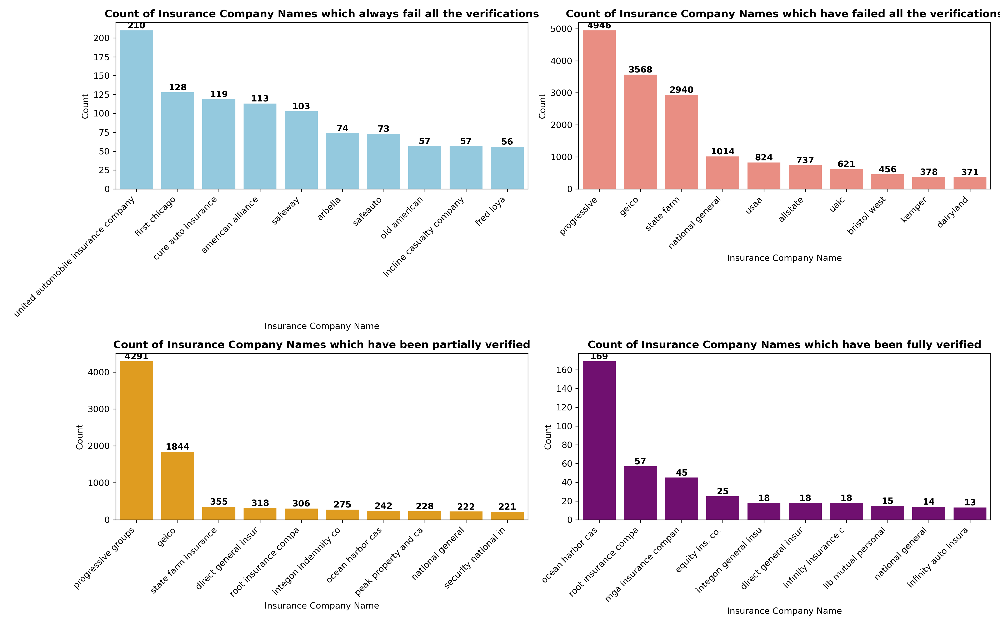
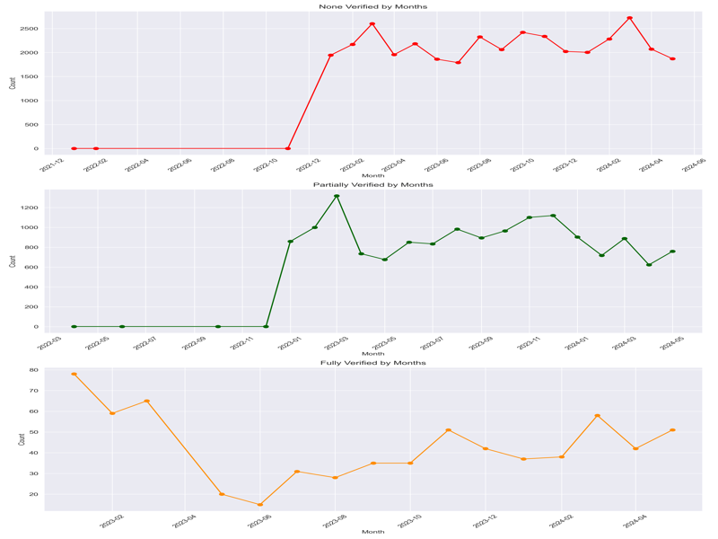

# Srdjan Injac

Welcome to my portfolio! This repository highlights my skills as a data analyst and showcases my key projects. Each project includes a detailed description, visualizations, and a link to its corresponding GitHub repository.

## About Me

I am a Senior Data Operations Analyst working for Vast. My expertise includes SQL, Python, data visualization, and statistical analysis.

---

## Projects

### 1. Assessing Verisk Accuracy for Insurance Verification

This project evaluates Verisk’s insurance verification accuracy by comparing database records with XML responses. I mimicked the validation rules used by the actual third-party provider, Verisk, using Python and conducted detailed analyses to extract trends and identify recurring patterns in verification outcomes. This approach provided actionable insights into the service's effectiveness.

**Key Technologies**: SQL, Python, XML parsing, matplotlib  

**Highlights**:
- Implemented Python-based rules to replicate Verisk's verification process and ensure policy compliance.
- Extracted and analyzed trends in full, partial, and non-verifications over specific time periods.
- Identified recurring insurance providers and their correlation with verification outcomes.
- Ensured robust handling of XML data to accurately validate rules against business requirements.

**Visualization**:  
_Trends in verification outcomes over specific periods._  
<section id="carousel">
  <h2>Project Visualizations</h2>
  

    

      
      
    

  

  

    <button onclick="prevSlide()">Previous</button>
    <button onclick="nextSlide()">Next</button>
  

</section>

<!-- Carousel JavaScript -->

👉 [View Full Project Repository](https://github.com/srdjan-injac/Verisk-Accuracy)
